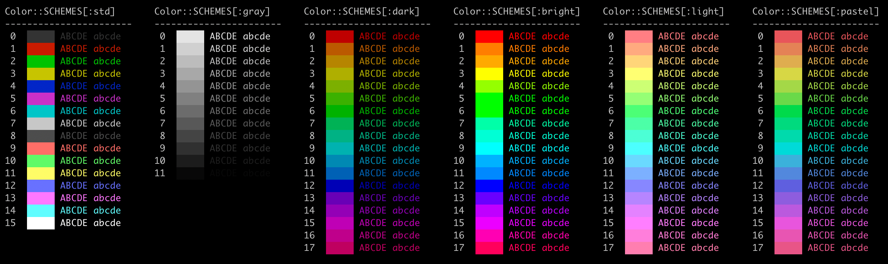

# Crystal Clear

[](https://github.com/bitmand/crystal_clear/releases)

[Crystal](https://crystal-lang.org/) library for building interactive and colorful terminal applications.

## Installation

1. Add the dependency to your `shard.yml`:

   ```yaml
   dependencies:
     crystal_clear:
       github: bitmand/crystal_clear
   ```

2. Run `shards install`

## Usage

```crystal
require "crystal_clear"
```

Try with examples in `examples/` dir:

```shell
crystal run example/spinner.cr
```

### Spinner

```crystal
require "crystal_clear"

CrystalClear::Spinner.start "Loading..."
sleep 5.seconds  # do some work for 5 sec
CrystalClear::Spinner.stop "done!\n"
```

### Terminal Size

```crystal
require "crystal_clear"

term = CrystalClear::Terminal.new
puts term.size.cols
puts term.size.rows
```

### Colors

Print colored text:

```crystal
require "crystal_clear"

CrystalClear::Color.print("text on purple background from :dark color scheme\n", :dark, bg: 13)
```

Set foreground and background colors:

```crystal
require "crystal_clear"

CrystalClear::Color.set(:dark, fg: 0)
puts "dark red text from :dark color scheme"
CrystalClear::Color.set(:gray, bg: 1)
puts "dark red text on light gray background from :gray color scheme"
CrystalClear::Color.reset
puts "regular colored text"
```

Show the different color schemes:

```shell
crystal run example/colors.cr
```



## Contributing

1. Fork it (<https://github.com/bitmand/crystal_clear/fork>)
2. Create your feature branch (`git checkout -b my-new-feature`)
3. Commit your changes (`git commit -am 'Add some feature'`)
4. Push to the branch (`git push origin my-new-feature`)
5. Create a new Pull Request

## Contributors

- [bitmand](https://github.com/bitmand) - creator and maintainer
